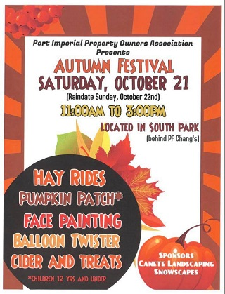

## Welcome to NYC Activities

### October Activities

10/21 Port Imperial Autumn Festival

Event Information
- Dates: Saturday, October 21, 2017
- Times: 11:00AM – 3:00pm
- Location: South park (Behind PF Chang's)
- Tickets: Free
- Activities:  Hay Rides, Pumpkin Patch, Face Painting, Balloon Twister

10/28 [Opening Day at Bryant Park](http://bryantpark.org/amenities/bank-of-america-winter-village-at-bryant-park) 

Event Information
- Dates: Saturday, October 28, 2017
- Times: 12:00PM – 10:00pm
- Tickets: Free

10/28 [Halloween Fun at American Museum of Natural History](https://www.amnh.org/calendar/halloween-celebration) 

Event Information
- Dates: Saturday, October 28, 2017
- Times: 2:00PM – 6:00pm
- Tickets: $15 for non-members & $12 for Museum Members

10/29 [Halloween Pumpkin Flotilla](http://www.centralparknyc.org/events/individual-events/halloween.html?utm_medium=social&utm_source=cpc-engagement&utm_campaign=201709_halloween&utm_content=fb?referrer=https://l.facebook.com/) 

Event Information
- Dates: Sunday, October 29, 2017
- Times: 4:00PM – 7:00pm
- Location: Location: Harlem Meer (East side from 106th to 110th Street)
- Tickets: Free
